## Part 1. Установка ОС 
- Версия Ubuntu.\
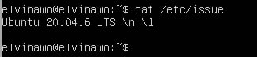
## Part 2. Создание пользователя 
- Вызов команды для создания пользователя (флаг -m - создавать домашний каталог пользователя, -g основная группа пользователя)\
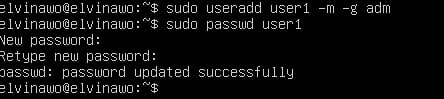
- Вывод команды cat /etc/passwd.\
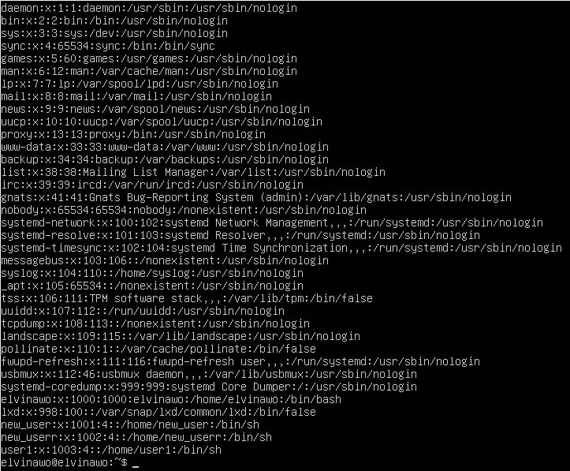
## <a id="part3">Part 3. Настройка сети ОС</a>
- Вызов команды для изменения названия машины. После вызова команды вручную меняем hostname и перезапускаем машину командой `reboot`.\
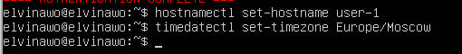
- Установка временной зоны, соответствующий моему текущему местоположению (командой `timedatectl list-timezones`  можно посмотреть список зон).\
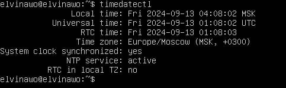
- Вывод названия сетевых интерфейсов.\
\
lo (loopback device) – виртуальный интерфейс, присутствующий по умолчанию в любом Linux. Он используется для отладки сетевых программ и запуска серверных приложений на локальной машине. С этим интерфейсом всегда связан адрес 127.0.0.1.
- команда для получения ip адреса устройства от DHCP сервера.\
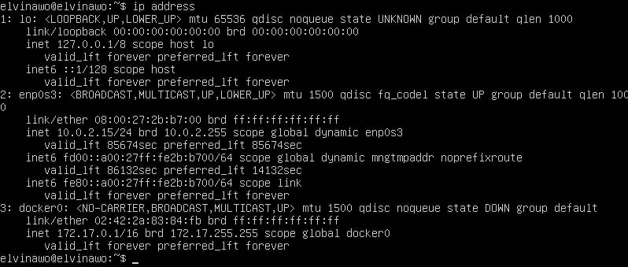\
DHCP - это клиент-серверный протокол динамической конфигурации хоста (Dynamic Host Configuration Protocol), с помощью которого в ИТ-инфраструктуре сетевые параметры каждого нового устройства прописываются автоматически. Использование DHCP существенно упрощает работу системных администраторов в случаях расширения сети.

- Вывод внешнего ip-адреса шлюза.\
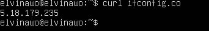
- Вывод внутреннего ip-адреса шлюза (по умолчанию).\
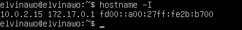
- Установливаем статические настройки ip, gw, dns вручную:
  - Команда для открытия файла с настройками `sudo nano /etc/netplan/00-installer-config.yaml`.
  - Файл перед изменением.\
  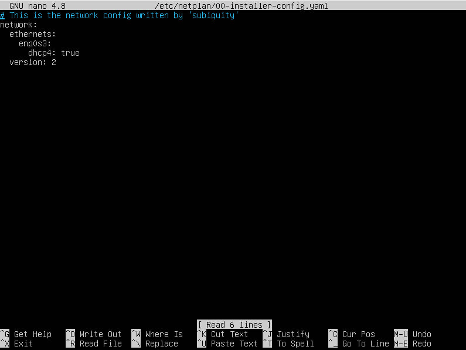
  - Файл после изменения.\
  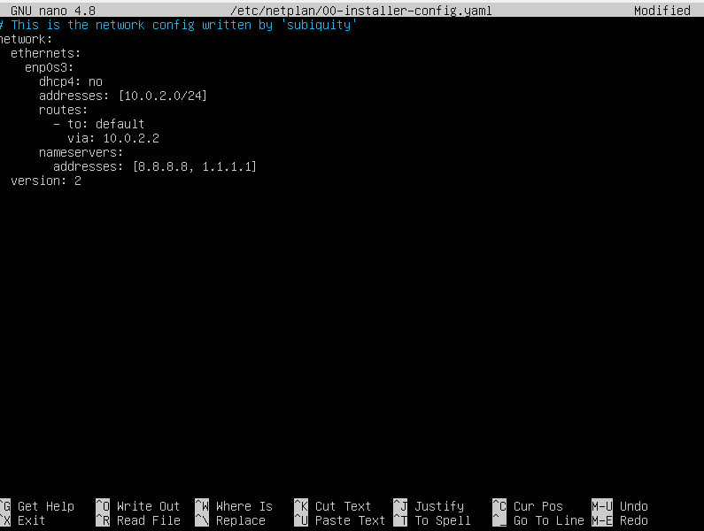
  - Проверяем изменения командой `netplan apply`. Если что то будет не так, то он покажет ошибки.
- Перезагружаем машину командой `reboot` и пингуем удаленные хосты.\
  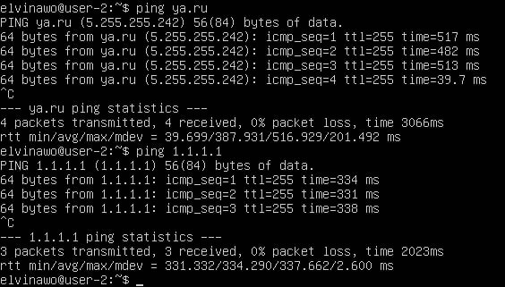

## Part 4. Обновление ОС 
- Сообщение, что обновления отсутствуют.\
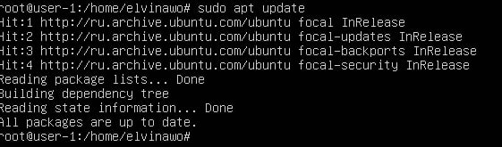
## Part 5. Использование команды sudo 
-  Команда sudo (substitute user and do, подменить пользователя и выполнить) позволяет строго определенным пользователям выполнять указанные программы с административными привилегиями без ввода пароля суперпользователя root. Если быть точнее, то команда sudo позволяет выполнять программы от имени любого пользователя, но, если идентификатор или имя этого пользователя не указаны, то предполагается выполнение от имени суперпользователя root.
- Нужно добавить пользователя в группу sudo.\
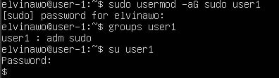
- Меняем hostname как в [Part 3](#part3), перезапускаем машину и проверяем.\
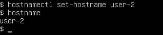
## Part 6. Установка и настройка службы времени 
- Настройка службы автоматической синхронизации времени.
 - Устанавливаем утилиту командой `sudo apt install ntp`.
 - Открваем конфигурыцию `sudo nano /etc/ntp.conf`.\
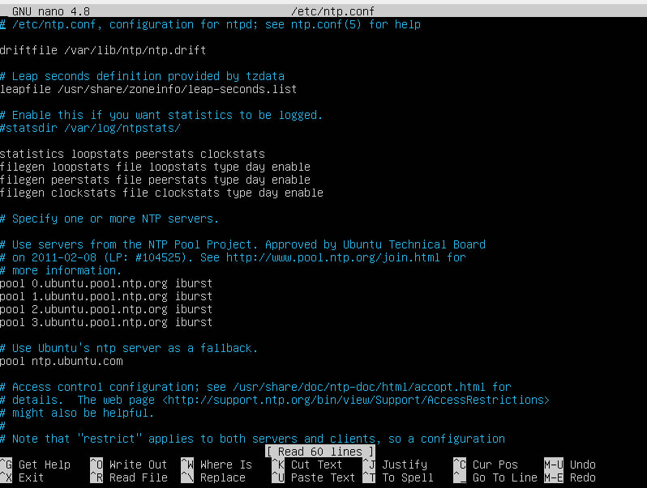
- Проверяем.\
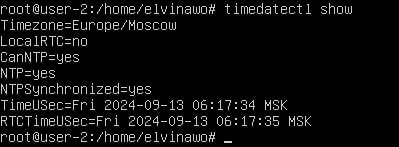
## Part 7. Установка и использование текстовых редакторов 
- Установка текстового редактора VIM.\
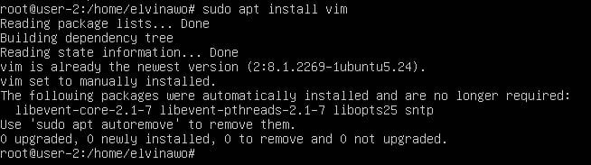
- Установка текстового редактора NANO.\
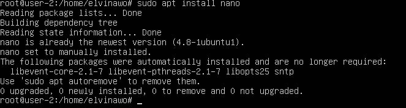
- Установка текстового редактора MCEDIT.\
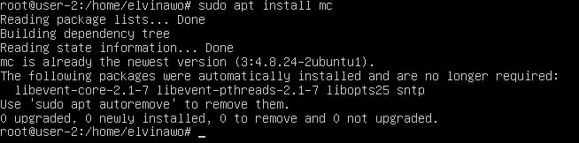
-  Выход с сохранением изменений VIM -  esc, :wq!, enter.\

-  Выход с сохранением изменений NANO - Ctrl + X, y, enter.\
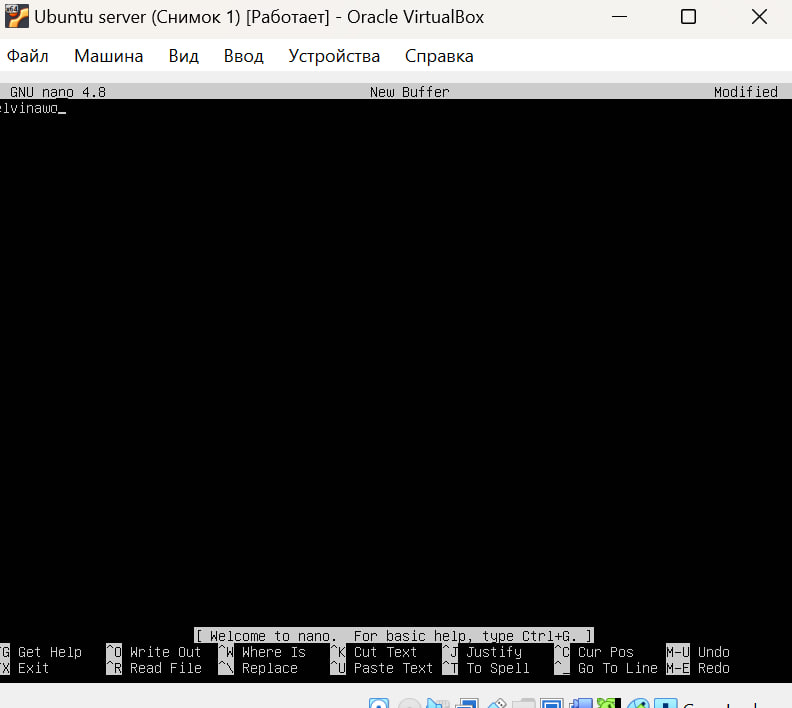
-  Выход с сохранением изменений MCEDIT - fn + f2, save, fn + f10.\
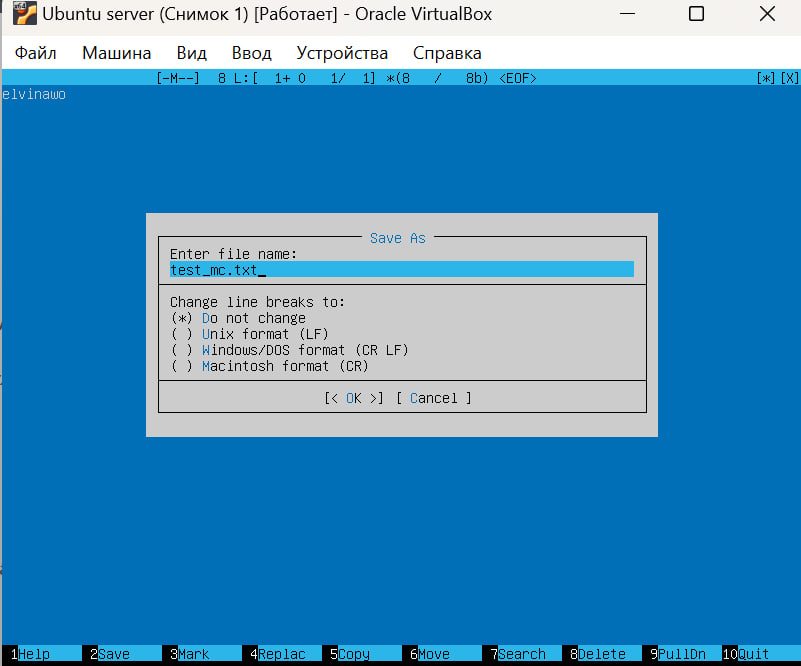
- Выход без сохранения изменений VIM - esc, :q!, enter.\
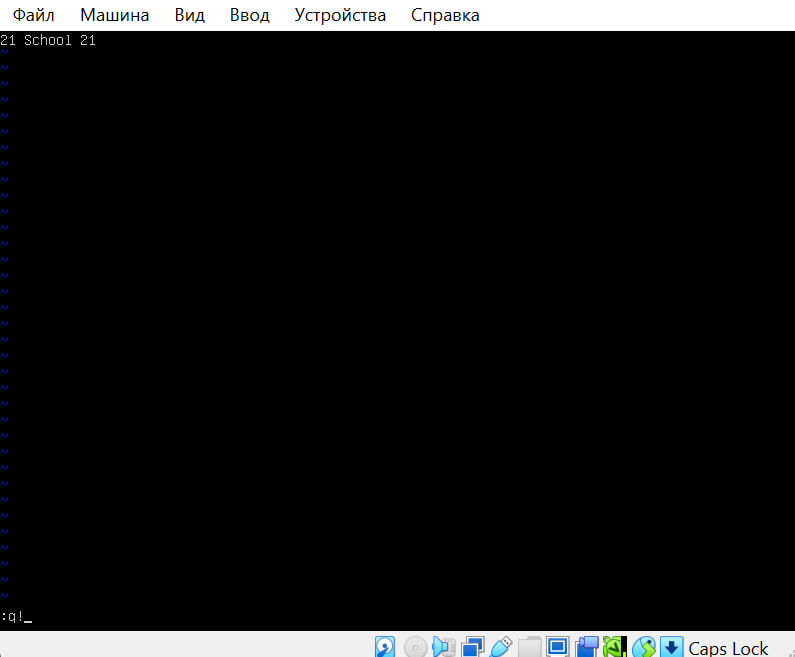
- Выход без сохранения изменений NANO - Ctrl + X, n, enter.\
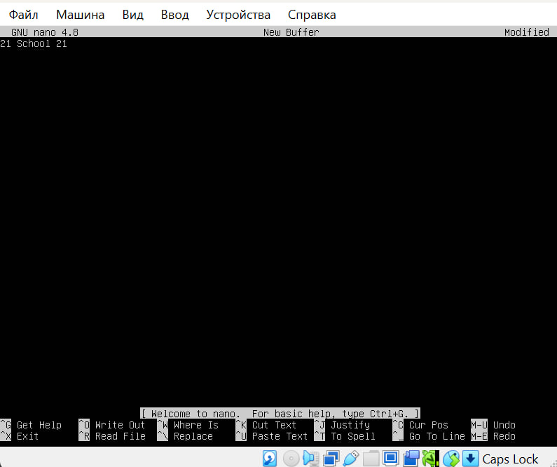
- Выход без сохранения изменений MCEDIT - fn + f10, no.\
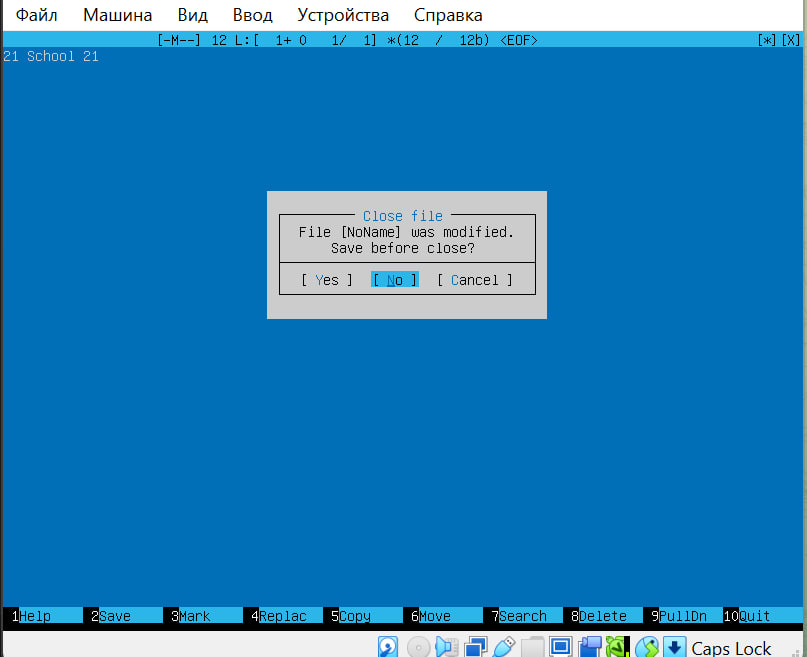
- Поиск и замена в VIM: поиск - /что ищем, замена - :диапазон/s/что меняем/на что/флаг кол-во (% весь диапазон, флаг g - меняет все совпадения в строке).\
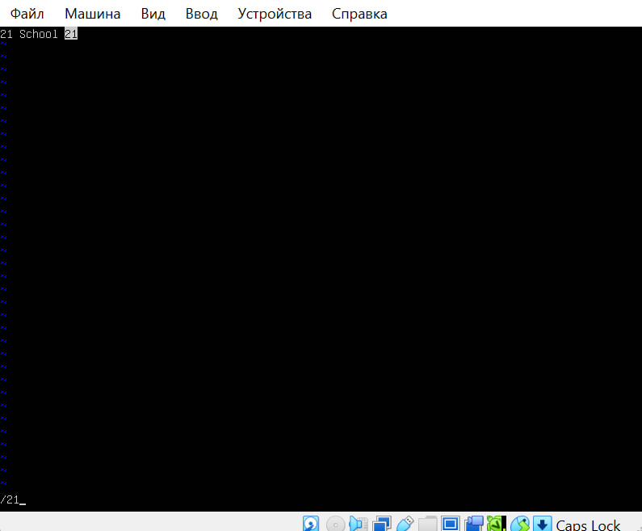

- Поиск и замена в NANO: поиск - Ctrl + W, замена - Ctrl + \ .\
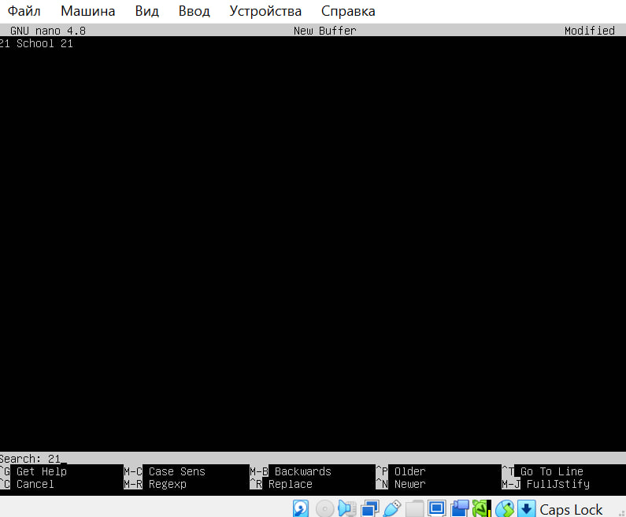
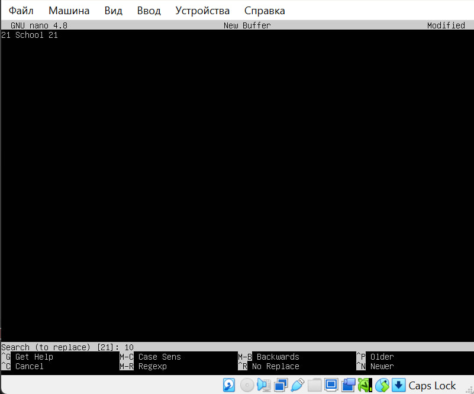
- Поиск и замена в MCEDIT: поиск - fn + f7, замена - fn +f4.\
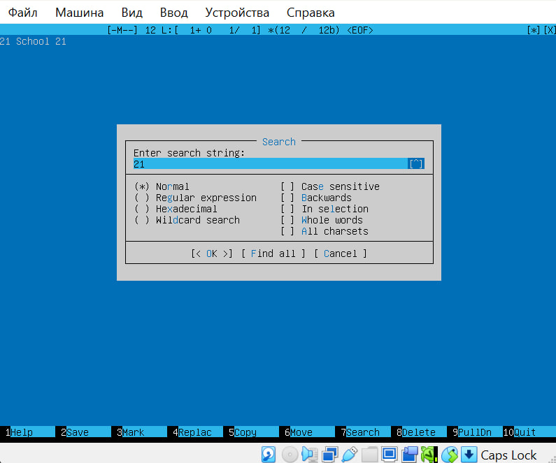
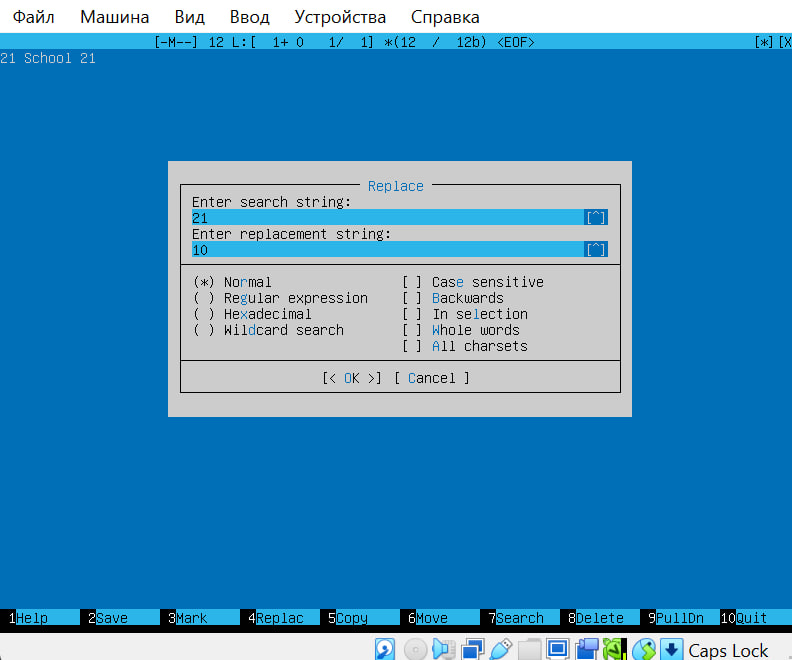
## Part 8. Установка и базовая настройка сервиса SSHD 
- Установка службы SSHd.
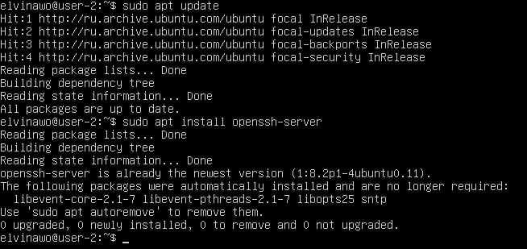
- Добавляем автостарт службы при загрузке системы командой `sudo systemctl enable ssh`.
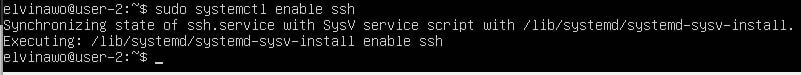
- Перенастройка службы SSHd на порт 2022: открываем конфигурацию командой `sudo nano /etc/ssh/sshd_config`, меняем порт 22 на 2022 и перезапускаем службу командой `sudo systemctl restart sshd`.
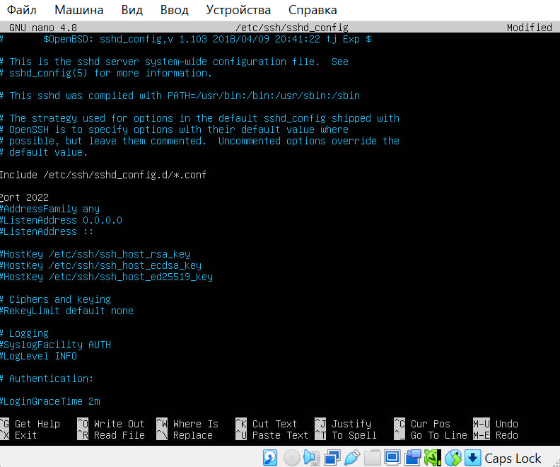
- Используя команду `ps -aux | grep ssh`(где флаг -a - выбрать все процессы, кроме фоновых; -u - выбрать процессы пользователя; -x - найти все вхождения строки поиска), покажем наличие процесса sshd.\
ps является очень гибким инструментом для определения работающих в системе программ и оценки    используемых ими ресурсов. Она выводит статистику и информацию о состоянии процессов в системе.
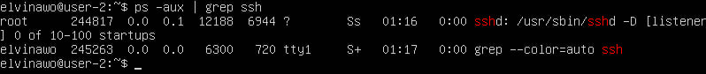
- Перезаружаем систему с помощью `reboot`. Устанавливаем net-tools и проверяем вывод команды `netstat -tan` (-tan - просмотр всех открытых TCP-протоколов, -n - имена в числовом виде, -a - все открытые протоколы, -t - просмотр TCP-протоколов).
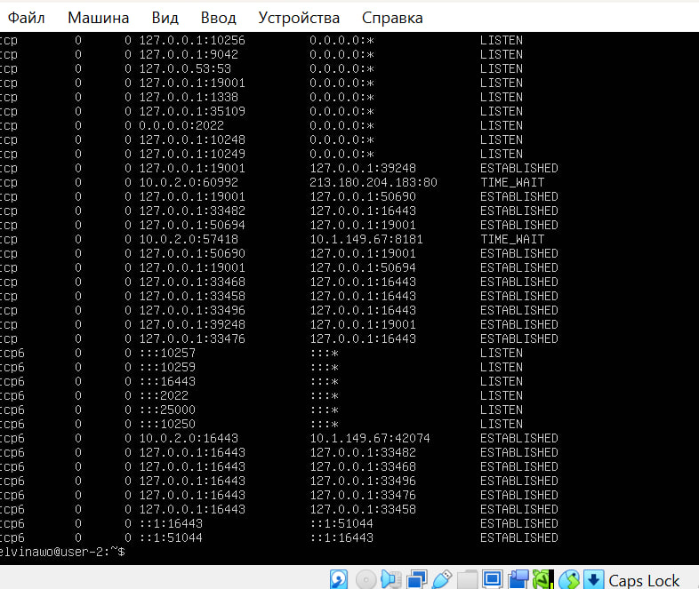
- Утилита netstat — это утилита командной строки , которая отображает сетевые соединения для протокола управления передачей (как входящие, так и исходящие), таблицы маршрутизации и ряд сетевых интерфейсов и статистику сетевых протоколов.\
Значение столбцов: 
  - Proto: Протокол, используемый в соединении (tcp или udp).
  - Recv-Q: Размер очереди приема равен 0. В этой очереди хранятся данные, которые уже получены от удаленного хоста, но еще не обработаны локальной программой.
  - Send-Q: 0 - размер очереди отправки равен 0. В этой очереди хранятся данные, которые должны быть отправлены удаленному хосту, но еще не отправлены.
  - Local Address: Локальный адрес и порт, используемые в соединении. 
  - Foreign Address: Удаленный адрес и порт, используемые в соединении.0.0.0.0 - это специальный адрес, который означает "любой адрес". " *" - это "любой порт".
  - State: LISTEN - этот сокет находится в состоянии прослушивания и ждет входящих соединений.
## Part 9. Установка и использование утилит top, htop
- Установлваем утилиту top и запускаем написав `top`.\
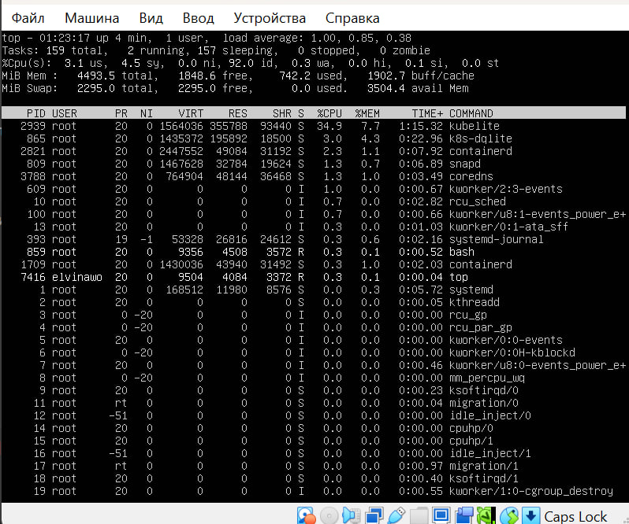
  - uptime - 4 min.
  - количество авторизованных пользователей - 1 user.
  - общую загрузку системы - 1, 0.85, 0.38 (за минуту, за 5 минут, за 15 минут).
  - общее количество процессов - 159 процессов.
  - загрузку cpu - 3%.
  - загрузку памяти - 742.2 из 4493.5.
- Установлваем утилиту top и запускаем написав `htop`.
- сортировка по PID:\
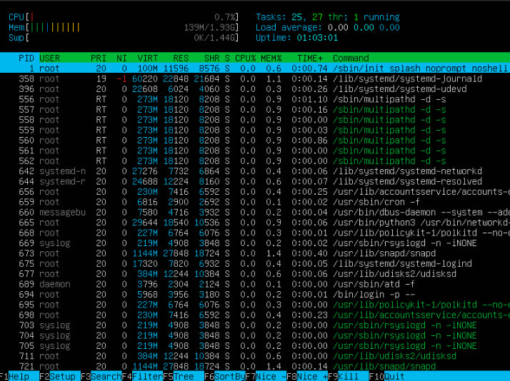
- сортировка по PERCENT_CPU:\
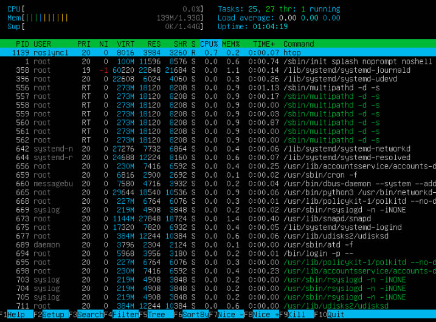
- сортировка по PERCENT_MEM:\
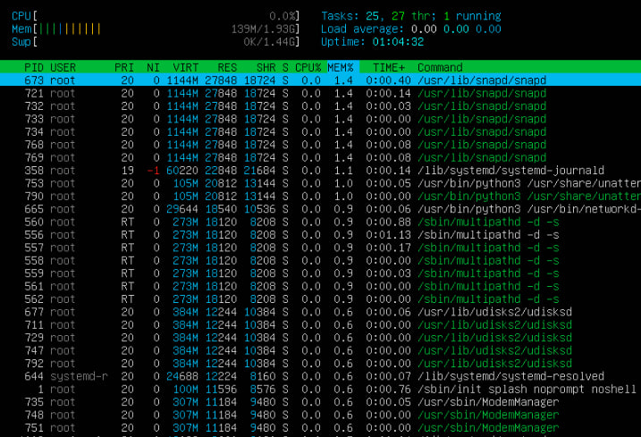
- сортировка по TIME:\
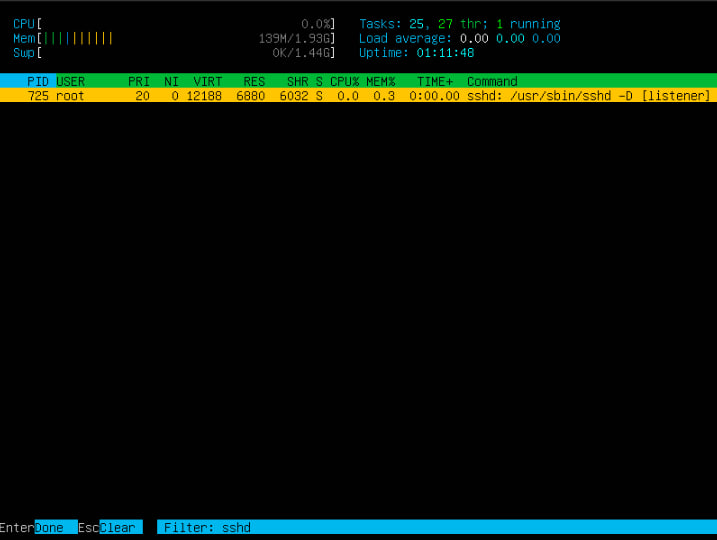
- процессом syslog, найденный, используя поиск:\
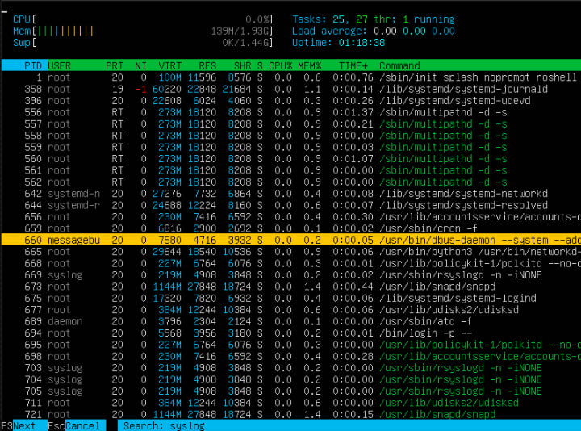
## Part 10. Использование утилиты fdisk
- Запускаем команду `sudo fdisk -l` (-l - вывести все разделы на выбранных устройствах или если устройств не задано, то на всех устройствах).\
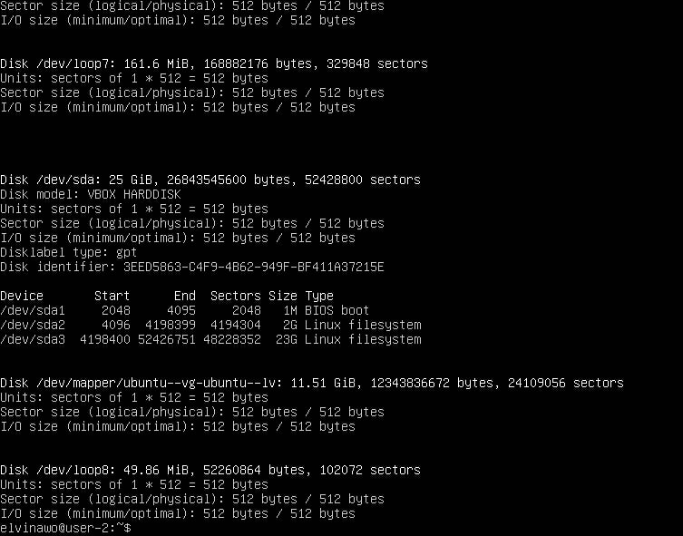
  - название жесткого диска - /dev/sda VBOX HARDDISK.
  - его размер - 10 GiB.
  - количество секторов - 48228352.
  - размер swap - 1.5G.
## Part 11. Использование утилиты df
- Вывод команды `df`.\
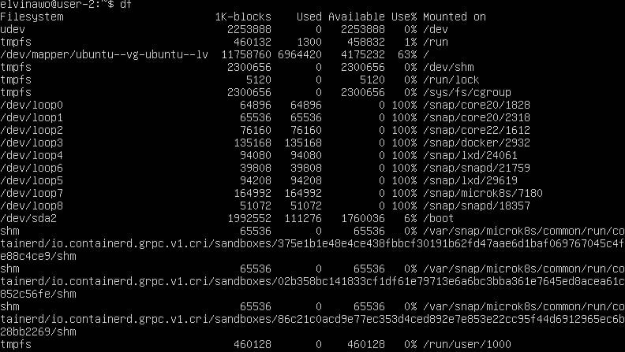
  - размер корневого раздела - 11758760.
  - размер занятого пространства - 6964420.
  - размер свободного пространства - 4175232.
  - процент использования - 63%.
  - Единица измерения - кибибайт.
- Вывод команды `df -Th`.\
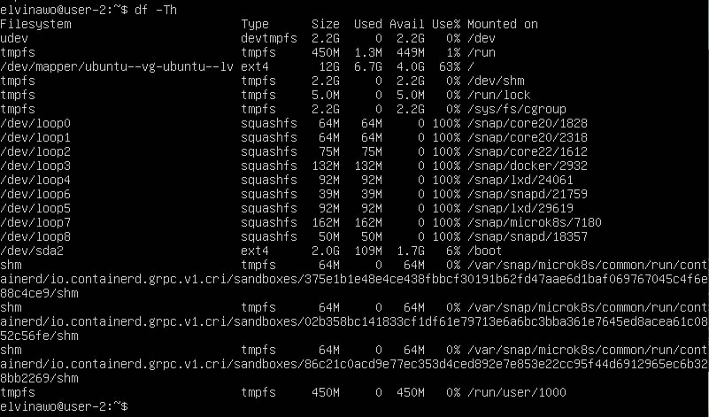
  - размер корневого раздела - 12G.
  - размер занятого пространства - 6.7G.
  - размер свободного пространства - 4.06G.
  - процент использования - 63%.
  - тип файловой системы для раздела - ext4.
## Part 12. Использование утилиты du
- Запуск команды du.\
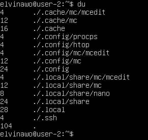
- Вывод размера папок (флаг s) /home, /var, /var/log (в байтах, в человекочитаемом виде - флаг h).\
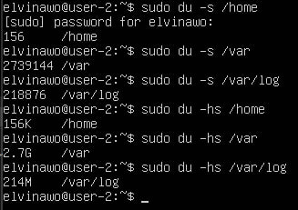
- Вывод размера всего содержимого в /var/log (не общее, а каждого вложенного элемента, используя *)\
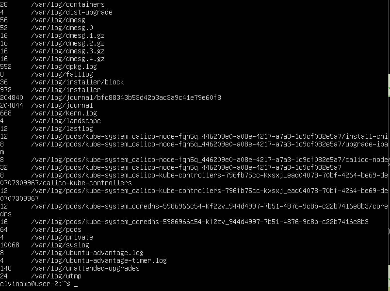
## Part 13. Установка и использование утилиты ncdu
- Установливаем утилиту ncdu командой `sudo apt install ncdu`.
- Выводим размер папок /home, /var, /var/log:\
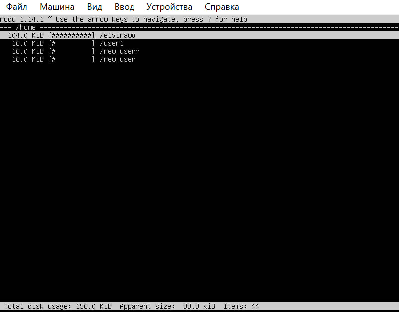
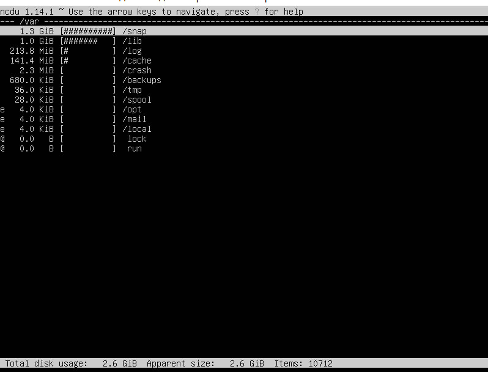
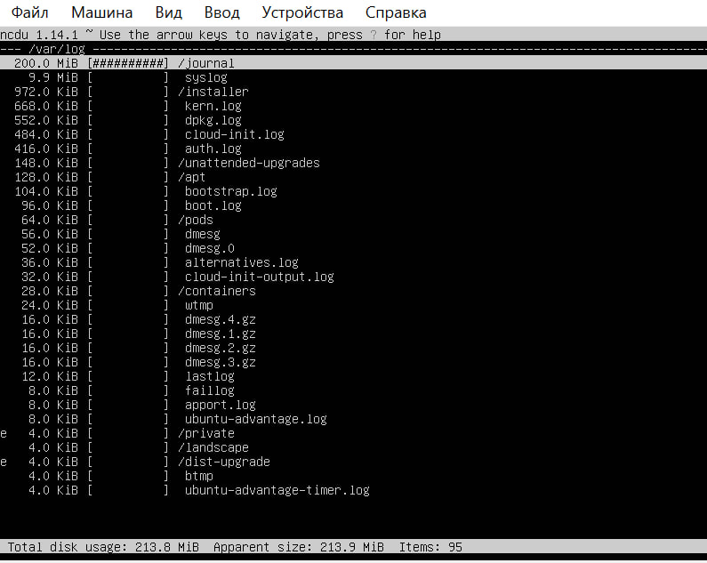
## Part 14. Работа с системными журналами
- Открываем файлы:\
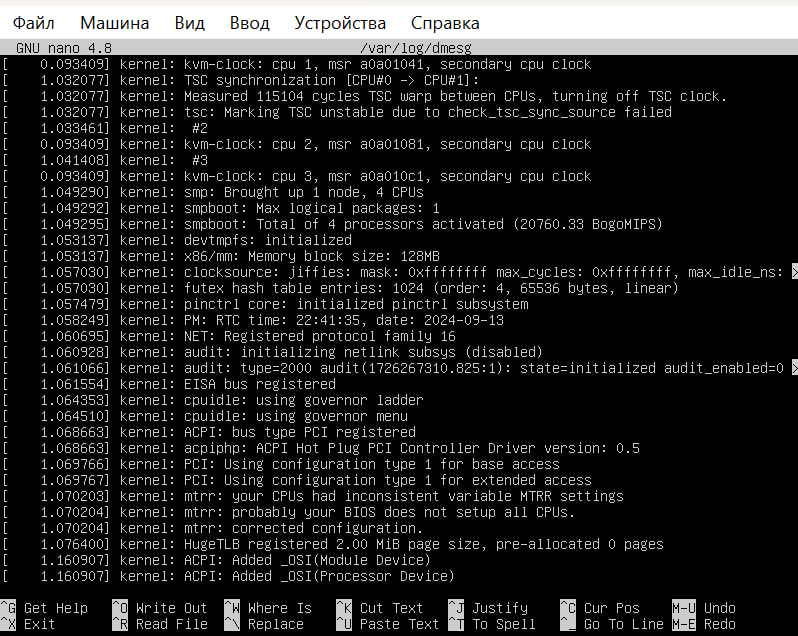
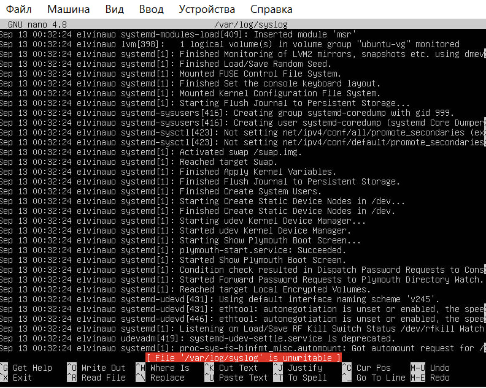
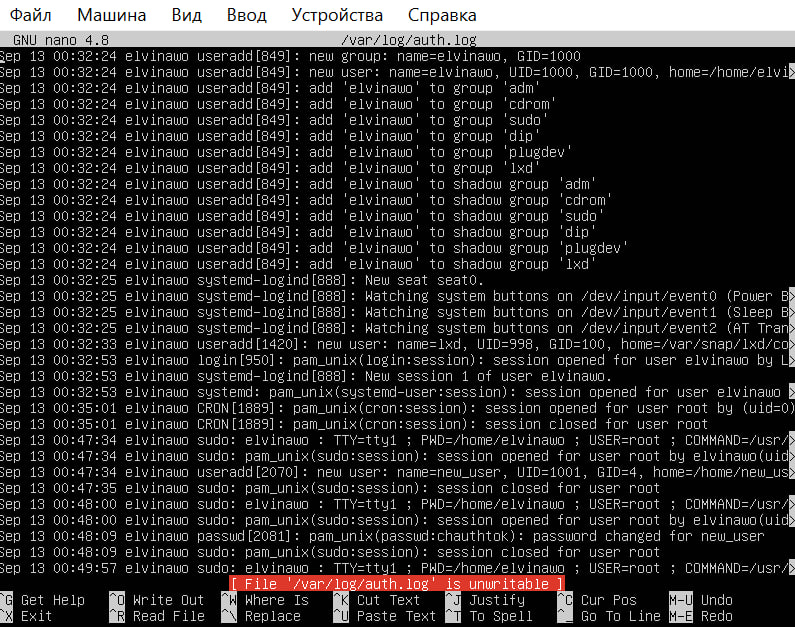
 - Метод входа в систему - uid=0.
- Перезапускаем службу SSHd комадой `systemctl restart sshd`.\
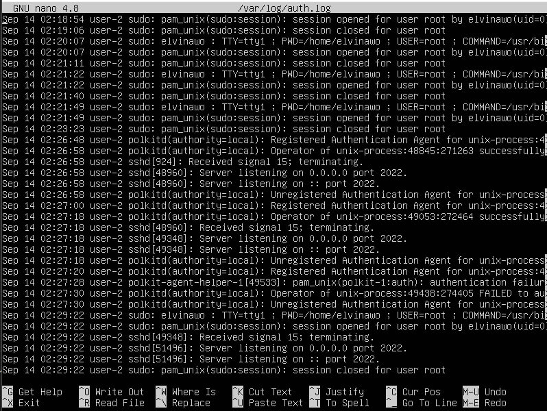
## Part 15. Использование планировщика заданий CRON
- Используя планировщик заданий, запуcкаем команду uptime через каждые 2 минуты.\
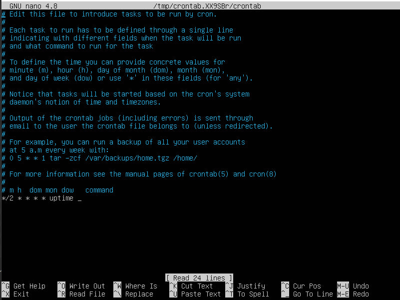
- Найдем в системных журналах строчки о выполнении.\
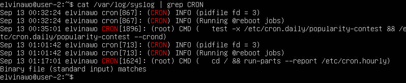
Выводим на экран список текущих заданий для CRON.\
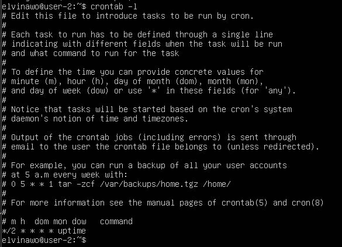
- Удаляем все задания из планировщика заданий.\
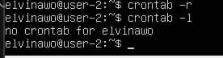