## Part 1. Ready-made docker

Take the official docker image from nginx and download it using `docker pull`.

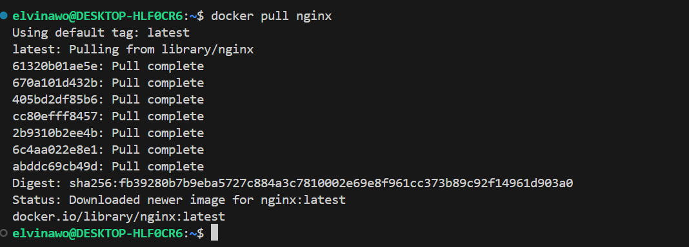

Check for the docker image to exist with `docker images`.

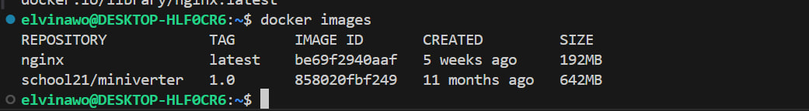

Run docker image with `docker run -d [image_id|repository]`.

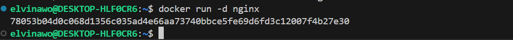

`-d` - is a flag that tell Docker to run container in detached mode. Container will work in the background, and command line will be free for further use.

Check that the image is running with `docker ps`.

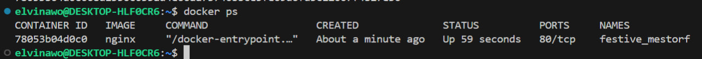

View container information with `docker inspect [container_id|container_name]`.

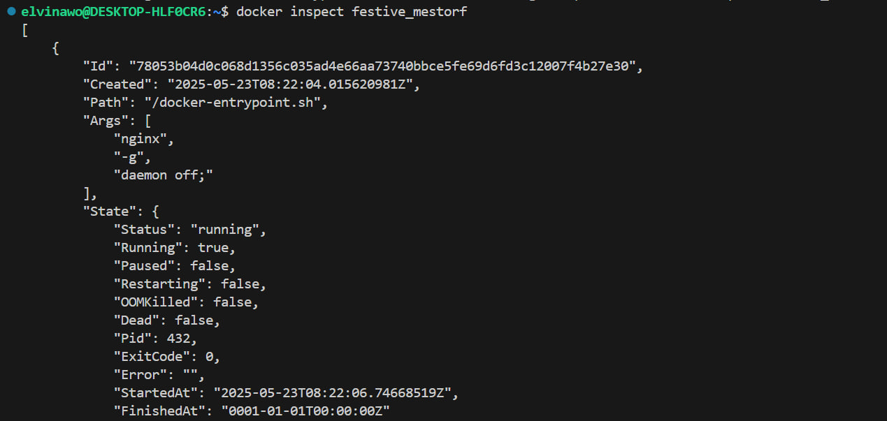

From the command output define and write in the report the container size, list of mapped ports and container ip.
Container size:

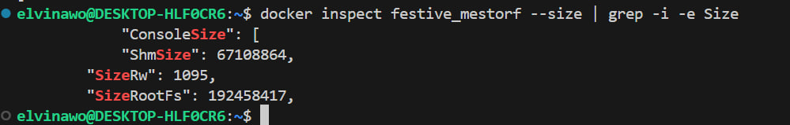

List of mapped ports:

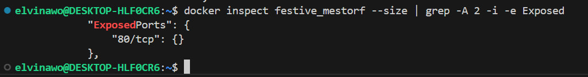

Container IP:

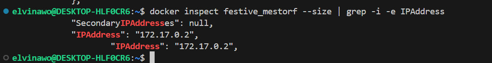

Stop docker container with `docker stop [container_id|container_name]`.
Check that the container has stopped with `docker ps`.

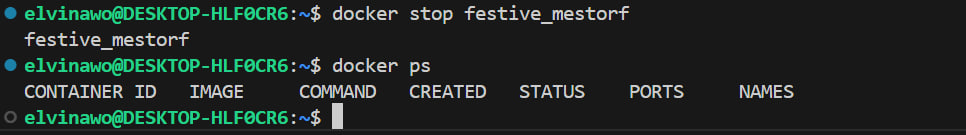

Run docker with ports 80:80 and 443:443 in container, mapped to the same ports on the local machine, with `run` command.
Check that the nginx start page is available in the browser at localhost:80.

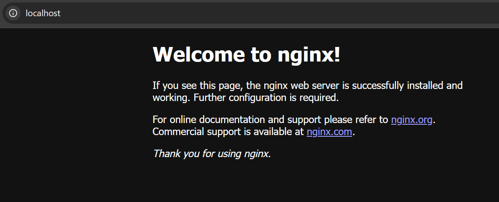

Restart docker container with `docker restart [container_id|container_name]`.
Check in any way that the container is running.

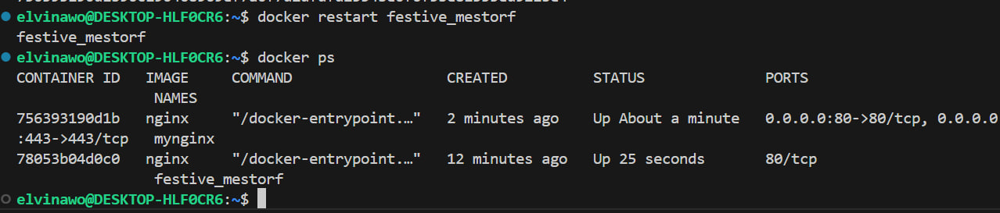

## Part 2. Operations with container

Read the nginx.conf configuration file inside the docker container with the `docker exec` command.

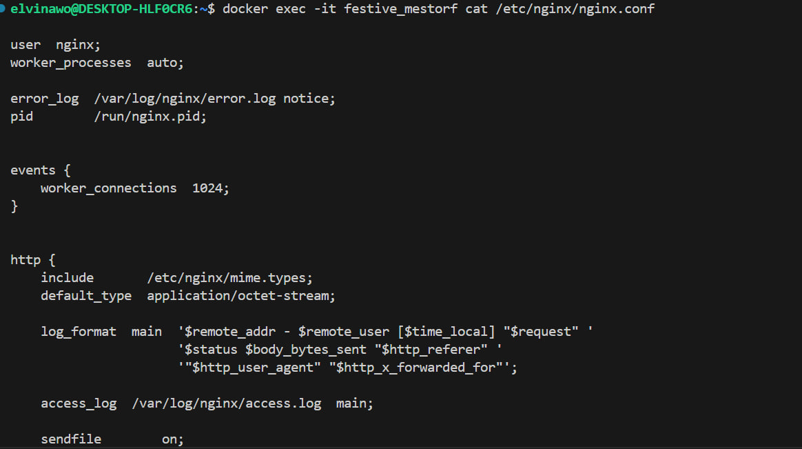

Create local `nginx.conf` file with command `touch nginx.conf`.
Configure it on the `/status` path to return the nginx server status page.

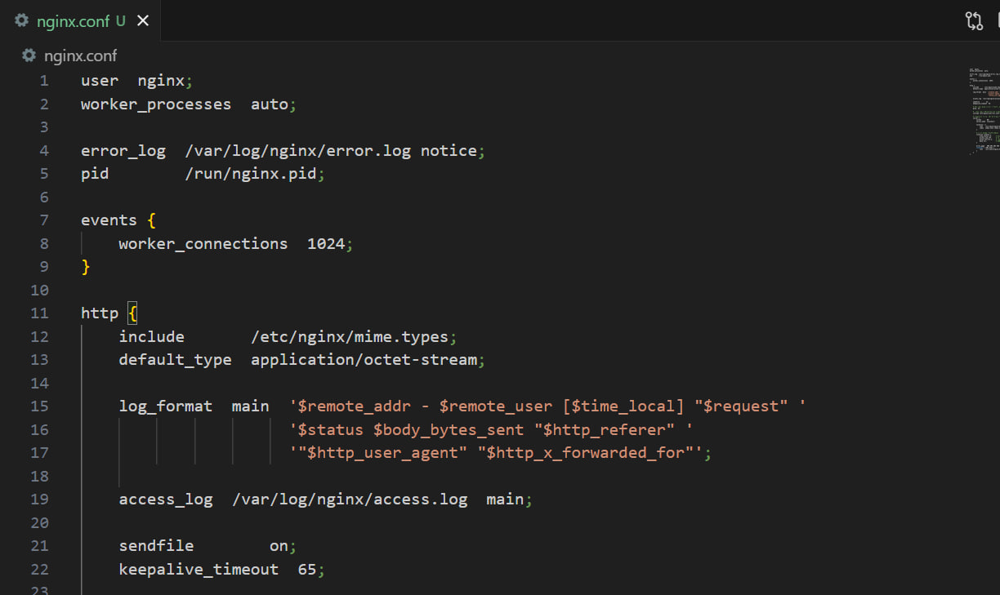

Copy the created `nginx.conf` file inside the docker image using the `docker cp` command.

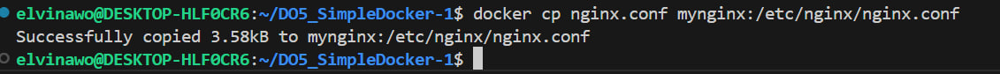

Restart nginx inside the docker image with `docker exec [container_id|container_name] nginx -s reload`.

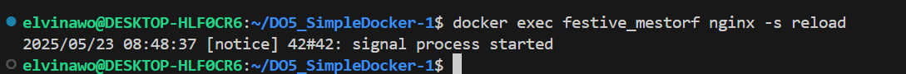

Check that `localhost:80/status` returns the nginx server status page.

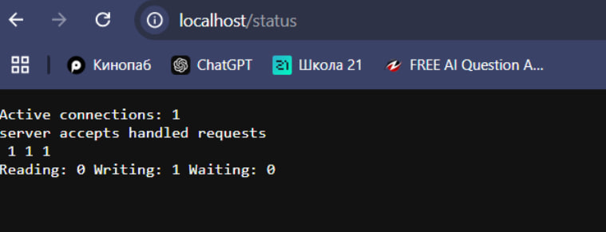

Export the container to a `container.tar` file with the `docker export` command.
Stop the container.

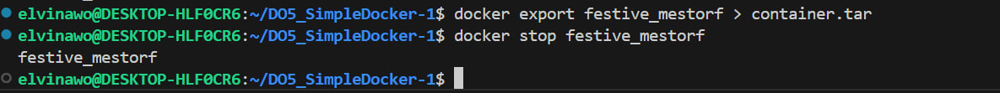

Delete the image with `docker rmi -f [image_id|repository]` without removing the container first.

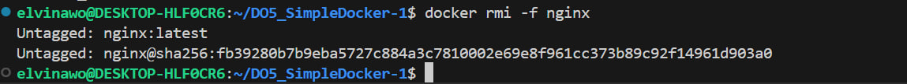

Delete stopped container with `docker rm [container_id|container_name]`

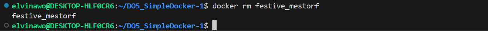

Import the container back using the `docker import` command.
Run the imported container with `docker run`.

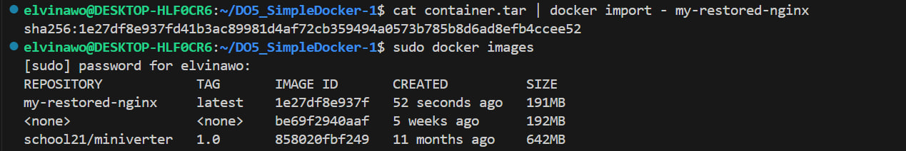

Check that `localhost:80/status` returns the nginx server status page.

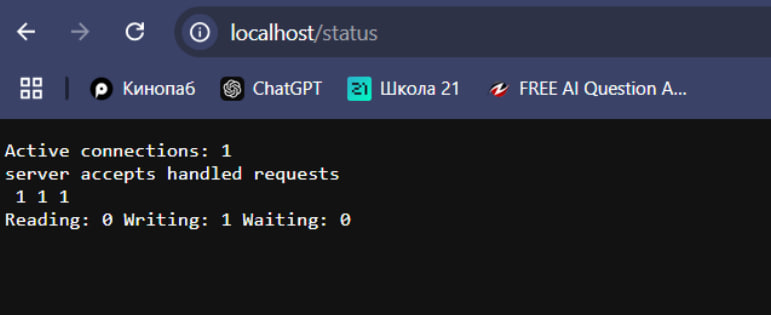

## Part 3. Mini web server

Write a mini server in C and FastCgi that will return a simple page saying `Hello World!`.

To make an own mini web-server it's needed to create `.c` file where server's logic will be described (with "Hello World!"). And need to make `nginx.conf` file which will proxy all requests from port 81 to port 127.0.0.1:8080.

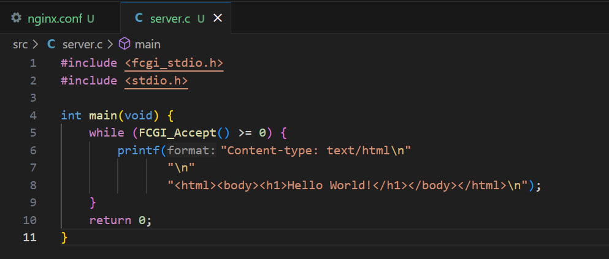

Now run new docker image with new container with `docker run -d -p 81:81 nginx`. 

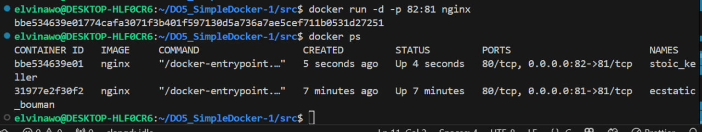

Then copy config and logic of server to new container with `docker cp nginx.conf`.

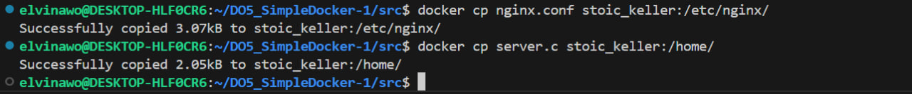

Install required utilities to run mini web-server on FastCGI, in particular `spawn-fcgi` and `libfcgi-dev`.

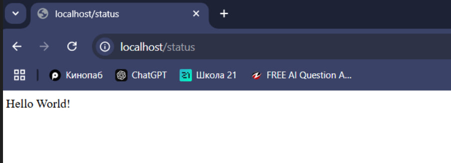

Compile and run mini web-server with `spawn-fcgi` on port 8080.

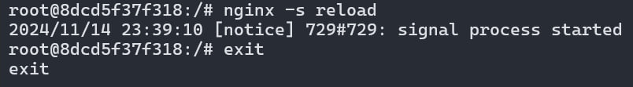

Check that browser on localhost:81 returns the page you wrote.

## Part 4. Your own docker

Write your own docker image that:
1) builds mini server sources on FastCgi from [Part 3](#part-3-mini- web-server);
2) runs it on port 8080;
3) copies inside the image written `./nginx/nginx.conf`;
4) runs `nginx`.

Build the written docker image with `docker build`, specifying the name and tag of our container.

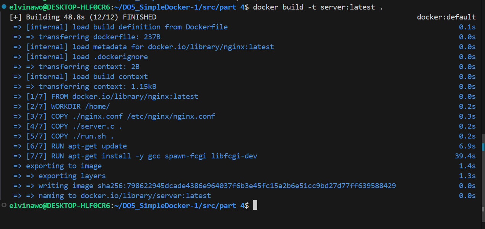

Check with docker images that everything is built correctly with `docker images`.

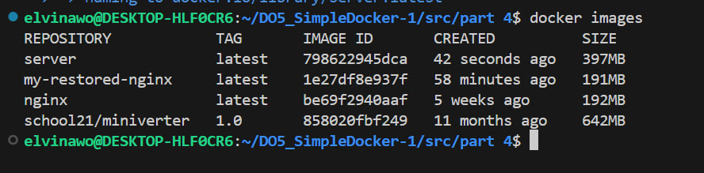

Run the built docker image by mapping port 81 to 80 on the local machine and mapping the `./nginx` folder inside the container to the address where the nginx configuration files are located (see Part 2).
Check that the page of the written mini server is available on localhost:80.
Add proxying of `/status` page in `./nginx/nginx.conf` to return the nginx server status.

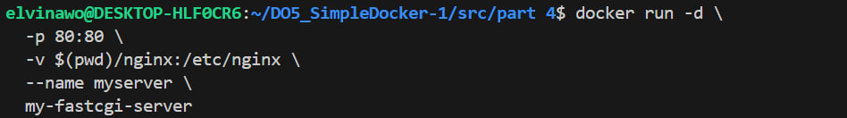

Restart docker image.
*If everything is done correctly, after saving the file and restarting the container, the configuration file inside the docker image should update itself without any extra steps
Check that localhost:80/status now returns a page with nginx status.

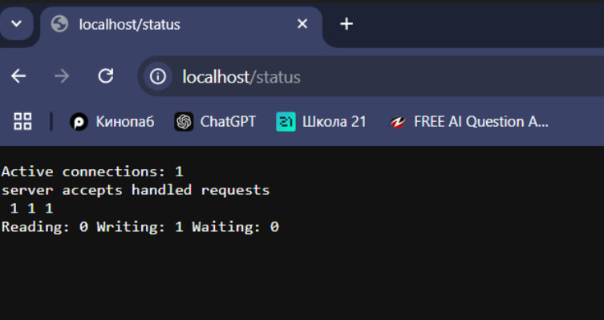

## Part 5. Dockle

First, install dockle.

Fix the image so that there are no errors or warnings when checking with dockle.

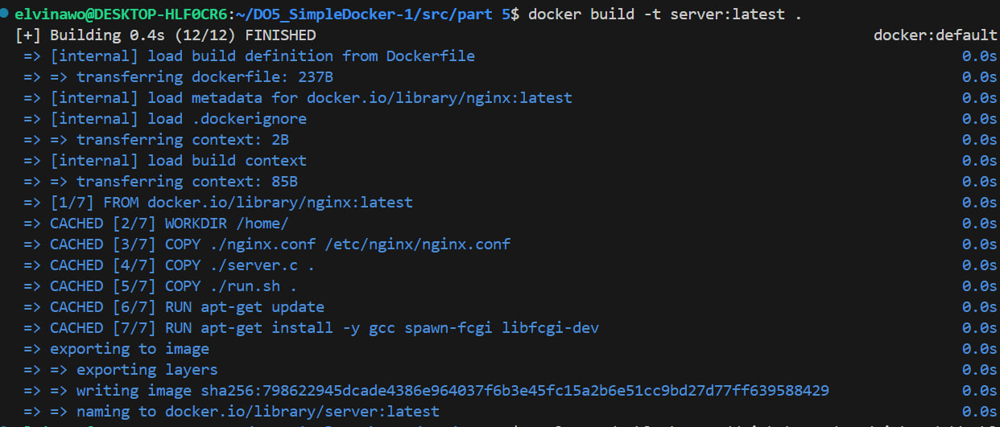

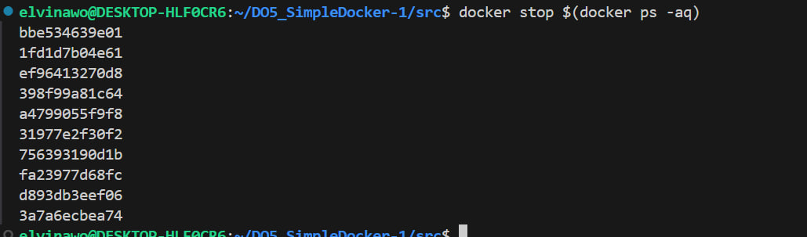

## Part 6. Basic Docker Compose

Stop all containers and change files.

Write a docker-compose.yml file, using which:
1) Start the docker container from Part 5 (it must work on local network, i.e., you don't need to use EXPOSE instruction and map ports to local machine).

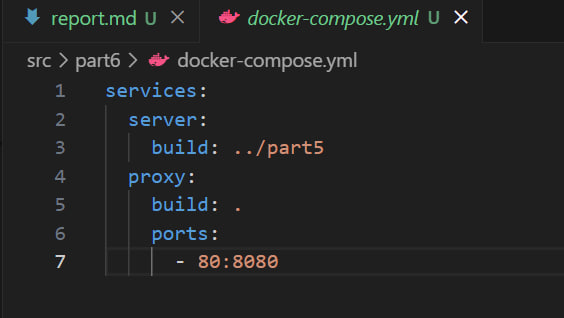

2) Start the docker container with nginx which will proxy all requests from port 8080 to port 81 of the first container.

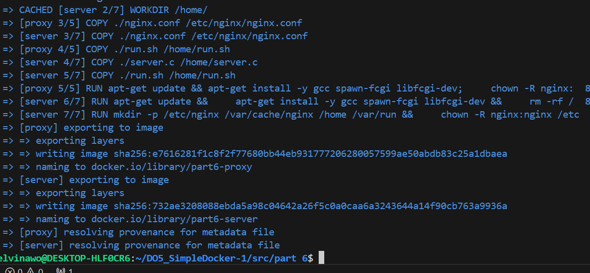

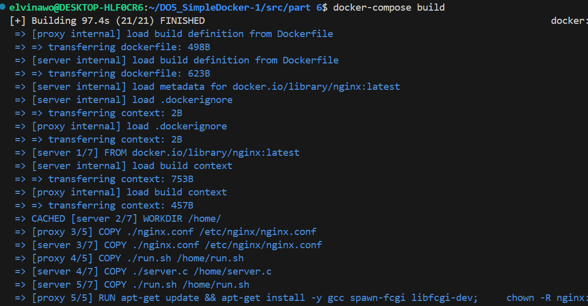

Map port 8080 of the second container to port 80 of the local machine.
Stop all running containers.
Build and run the project with the docker-compose build and docker-compose up commands.

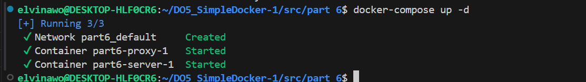

Check that the browser returns the page you wrote on localhost:80 as before.

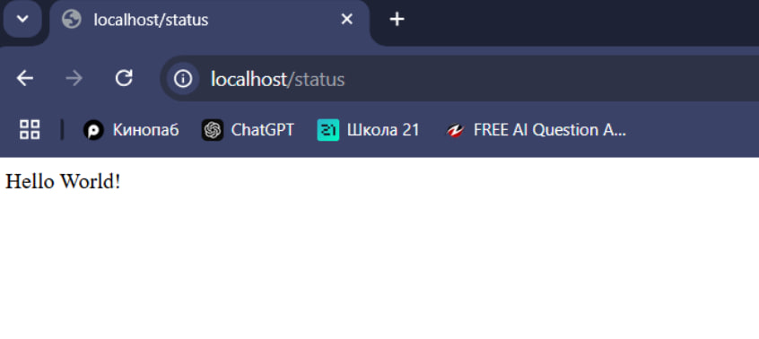